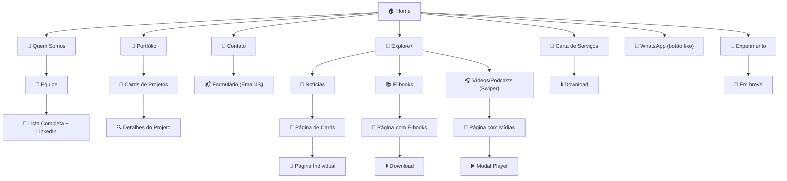

# Website ASCII

O site institucional da ASCII Empresa Júnior foi desenvolvido com o objetivo de divulgar a marca, os serviços e os valores da empresa, promovendo uma comunicação clara com possíveis clientes, parceiros e o público geral.

## 🗺️ Fluxograma de Navegação



## 🚀 Páginas do Site

- **Home:** visão geral da empresa, serviços, missão/visão/valores, avaliações, formulário de contato.  
- **Quem Somos:** lideranças, equipe, redes sociais, nossa história.  
- **Portfólio:** projetos realizados.  
- **Explore+:** hub de conteúdos como notícias, e-books e vídeos/podcasts.  

---

## 🛠️ Tecnologias Utilizadas

### 🔧 Build  
Create React App

### 📚 Bibliotecas e Dependências  
- EmailJS  
- Swiper  
- React Modal  
- React Router  

### 💻 Linguagens e Frameworks  
- React.js  
- JavaScript (ES6+)  
- CSS Modules  
- CSS3  

### 🎨 Design e Prototipagem  
- Figma  

---

## Dependências e Versões Necessárias

- **Node.js** - Versão: 22.11.0

---

## ✅ Como rodar o projeto 

Siga os passos abaixo para executar a aplicação em seu ambiente local:

### Pré-requisitos  
Antes de começar, verifique se você possui instalado em sua máquina:  
- Node.js

### Passo a passo

1. Clone o repositório  
   ```bash
   git clone https://github.com/asciiej/website-ASCII.git
   ```

2. Acesse a pasta do projeto  
   ```bash
   cd [CAMINHO_DA_PASTA_DO_PROJETO]
   ```

3. Instale as dependências  
   ```bash
   npm install
   ```

4. Inicie a aplicação  
   ```bash
   npm start
   ```

Após executar o comando seu navegador padrão deve abrir automaticamente na página ‘http://localhost:3000’

---
## ℹ️ Informações importantes sobre a aplicação

Aprenda como inserir informações no sistema e manter os dados atualizados.

## ➤ Seção Explore+

A seção Explore+ do site possui três categorias de conteúdo:  
📚 E-books | 📰 Notícias | 🎙 Vídeos/Podcasts  
Todos os conteúdos são carregados dinamicamente a partir de arquivos JavaScript localizados na pasta `src/data`.

### 🧩 Onde editar?

| Tipo de conteúdo | Caminho do arquivo           |
|------------------|-----------------------------|
| E-books          | `src/data/ebooksData.js`    |
| Notícias         | `src/data/noticiasData.js`  |
| Vídeos/Podcasts  | `src/data/asciiplayCards.js`|

---

## ✍️ Como adicionar um novo item?

Cada arquivo contém uma lista (array) de objetos com as informações a serem exibidas. Para adicionar um novo conteúdo, copie um item existente, cole logo abaixo e edite com o novo conteúdo.

---

### 📚 E-books

- **id:** número único e sequencial.  
- **title:** título com no máximo 2 linhas. O que passar disso não será mostrado.  
- **description:** descrição com até 4 linhas. O que passar disso não será mostrado.  
- **image:** imagem obrigatória, importada no topo do arquivo, com tamanho padrão 1024x1536.  
- **file:** deve estar em `public/downloads/` e informado como `/downloads/ebook-nome.pdf` para download.  

---

### 📰 Notícias

- **id:** número único e sequencial.  
- **title:** até 3 linhas. O que passar disso não será mostrado.  
- **description:** deve ser exatamente "ASCII Explore+".  
- **image:** imagem importada no topo do arquivo.  
- **fullText:** texto completo da notícia.  

📌 Evite blocos grandes de texto sem espaçamento — use `\n` para separar parágrafos.

📌 Para mudar a notícia principal, edite a linha:  
```js
const destaque = noticiasData[0];
```
no arquivo `components/noticias/Noticias.jsx`.

---

### 🎙 Vídeos e Podcasts

- **type:** escolha apenas "VÍDEO" ou "PODCAST".  
- **date:** formato "MÊS abreviado DIA" (ex: JUN 20).  
- **title:** até 3 linhas. O que passar disso não será mostrado.  
- **summary:** até 3 linhas. O que passar disso não será mostrado.  
- **youtubeId:** código que aparece após v= no link do YouTube.  
- **imageSrc:** imagem de capa, importada no topo do arquivo, com tamanho padrão quadrado. 

📌 Exemplo:  
No link `https://www.youtube.com/watch?v=Rh2JTF85h40`, o `youtubeId` é `Rh2JTF85h40`.

---

### ✅ Boas práticas:

- Sempre verifique se todos os campos estão preenchidos.  
- Não repita ids já existentes.  
- Mantenha o padrão visual das imagens (mesmo tamanho/dimensões).  
- Priorize títulos objetivos e resumos curtos.

---

## ➤ Seção Portifólio

Documentação em construção

---

## ⏭️ Próximos passos

Vamos criar uma página de experimentos no site, com jogos, demonstrações de IA e outras interações. A ideia é oferecer um espaço experimental para os usuários explorarem novas tecnologias.

